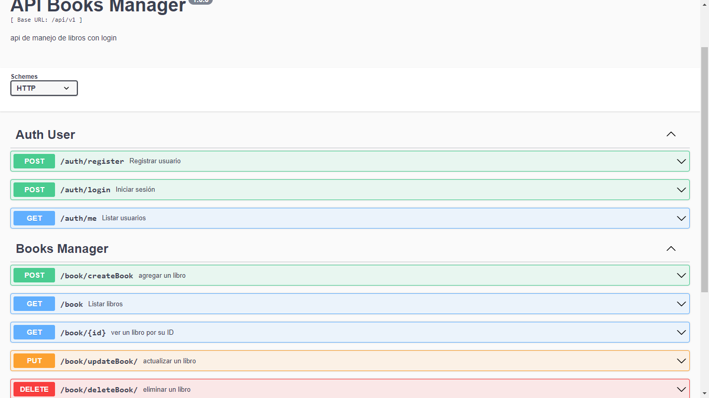

# api_books_manager

### 💻commant start: ⌨ npm run dev
<h5>URL API DOCUMENTATION: <a href="http://localhost:4000/api-v1-docs/">http://localhost:4000/api-v1-docs/</a></h5> 

<h4>📄configure .env</h4>
<ul>
<li>PORT = ""</li>
 

📃info database📄

<li>PORTDB_NAME = "mydb"</li>
<li>DB_USER = "myuser"</li>
<li>PORTDB_NAME = "mydb"</li>
<li>BD_PASSWORD = "password"</li>
<li>DB_HOST = 'localhost'</li>
 

🔐Secret Key🔐

<li>JWT_SECRET = " "</li>
<li>SESSION_SECRET = " "</li>
</ul>
<h4>📂create file:🗂️/uploads</h4>
